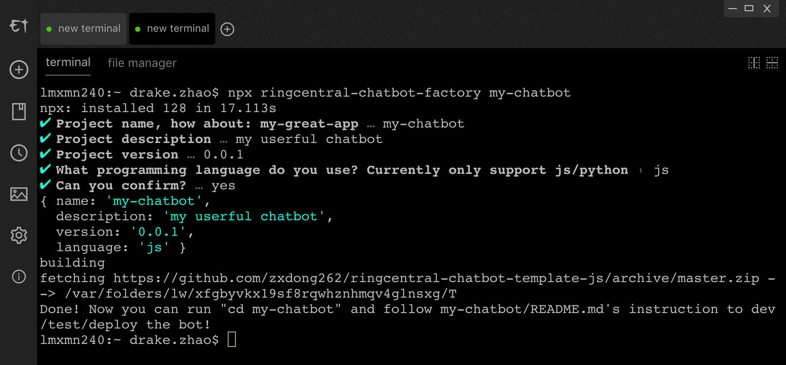

# ringcentral-chatbot-factory

[](https://travis-ci.org/zxdong262/ringcentral-chatbot-factory)


Cli tool to generate RingCentral chatbot code.



Video:

(https://youtu.be/c13V6ZkHP7g)[https://youtu.be/c13V6ZkHP7g]

## Templates

- [https://github.com/zxdong262/ringcentral-chatbot-template-python](https://github.com/zxdong262/ringcentral-chatbot-template-python)
- [https://github.com/zxdong262/ringcentral-chatbot-template-js](https://github.com/zxdong262/ringcentral-chatbot-template-js)

## Use

```bash
# make sure you have npm@5.2+ installed
# use nvm to install nodejs/npm is recommended
npx ringcentral-chatbot-factory my-app
# or install it first
# npm i -g ringcentral-chatbot-factory && rcf my-app
# then carefully answer all questions, then the my-app folder will be create
cd my-app

# follow the instruction of my-app/README.md to dev/run/test the bot
```

## Init bot project in one line script

```bash
# use wget
wget -qO- https://raw.githubusercontent.com/zxdong262/ringcentral-chatbot-factory/master/bin/init.sh | bash

# use curl
curl -o- https://raw.githubusercontent.com/zxdong262/ringcentral-chatbot-factory/master/bin/init.sh | bash
```

## License

MIT
